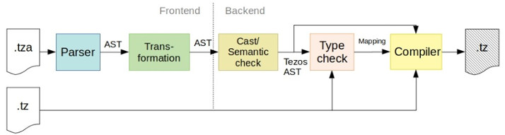

# Checking assertions for smart contracts
This project contains the material and code developed during the course of my master's thesis
with the working title "Assertions for distributed refutation (or validation) of
properties in smart contracts" at the chair of programming languages, Albert
Ludwig University of Freiburg.

## Motivation - the short version
This project provides a small language and a the basis of a compiler pipeline to allow you to
write assertions for your (Michelson) smart contracts that are checked in a
distributed fashion by the validators of the (Tezos) network. The code covers most of the off-chain
part of the project - the theory and design of the on-chain part is briefly discussed in the thesis.

## Getting started
The frontend as well as the Tezos backend of the pipeline is written in OCaml and uses the `Dune` build system. You'll need OCamls package manager `opam` installed.

### Dependencies
If you want to build the pipeline with the Tezos backend, you'll also need to install the official Tezos libraries with opam:  
`opam install tezos`

Some unit tests are written with the test framework `alcotest`:  
`opam install alcotest alcotest-lwt qcheck-alcotest`

To communicate with the local node, the Tezos backend also depends on our own Tezos API. You'll need to either copy the API into the pipeline project or create a softlink (refer to STRUCTURE_OVERVIEW.md on where to put it).

### Build and run
Build and run the pipeline by running these commands in the `src/offline` directory:  
`dune build ./main.exe`  
`dune exec -- ./main.exe --help`

### Running Tests
Run all unit tests by running the following command in the root directory:  
`dune runtest`

The tests are written using the frameworks [Alcotest](https://github.com/mirage/alcotest) and [Expect-test](https://github.com/janestreet/ppx_expect).

### Switch backends
The interface of the backend (```check_and_compile.mli```) is defined as a virtual
library, for which several implementations can be provided. The root dune file specifies,
which implementation should be linked into the executable:

<pre>
(executable
  (name main)
  ...
  (libraries ...
            <b>tezos_backend</b>))
...
</pre>

### Versioning
As Tezos' protocol is regularly updating to new versions, the Tezos backend (as
well as the API!) has to be updated regularly as well to use the latest protocol version. In the best case, this will only concern the library dependencies in
the dune files and some imports within the modules. More adaptions are needed
within the API (and possibly the backend) if Tezos internally changes some interfaces
or datatypes.

As a pointer: to update from Delphi to Edo protocol, the following changes would be required
in `src/offline/tezos/typecheck/dune`:

<pre>
<s>tezos-client-007-PsDELPH1</s>
tezos-client-008-PtEdo2Zk
....
<s>(select void_for_linking-007-PsDELPH1 from
  (tezos-client-007-PsDELPH1-commands.registration -> void_for_linking-007-PsDELPH1.empty)
  (-> void_for_linking-007-PsDELPH1.empty)))</s>

  (select void_for_linking-008-PtEdo2Zk from
    (tezos-client-08-PtEdo2Zk-commands.registration -> void_for_linking-008-PtEdo2Zk.empty)
    (-> void_for_linking-008-PtEdo2Zk.empty)))
</pre>

Depending on the changes introduced with the updates, the grammar, parser and backend might need to be changed as well (for instance if new data types or useful operations
have been added).

## The grammar
The grammar in `doc/grammar` describes a small language to express assertions on
logical formulae. Although formulae not featuring universal or existential quantifiers
are admissible, they don't benefit as much from the distributed checking.

The datatypes, operations and structures in the grammar reflect those present in
all supported blockchain VMs, i.e., the grammar represents their union. This allows
to reuse the same parser and transformation for all targets. The respective backends
are responsible to reject any assertions containing types or operations which are not
supported in the target language.

Some operations, however, are crucial for implementing the type of assertion checking
we aim for - VM's not supporting these need to be extended:
- Universal quantifier ∀
- Existential quantifier ∃
- List/array indexing (`at()`)

The current version of the pipeline only supports the prefix-notation of the grammar
described in `doc/grammar/assertion_grammar_prefix.txt`.

## The pipeline
The code implements a pipeline - the input is a smart contract and one or more assertions that express properties on the entrypoint parameters. The graphic shows the overall pipeline and its stages
with the Tezos backend:


The **frontend** consists of the common stages parser and the transformation. That way, they can be
shared between different backends.

In the **backend**, the general assertion AST is cast to a target language specific AST.
During the casting, semantic checks are performed to make sure, that the AST doesn't
contain types or operations which are not supported by the target language.  
The type check stage makes sure that the entrypoints of the assertions match the type
of the smart contract and that they can be assigned to each other unambiguously.
Lastly, the compiler translates the ASTs into a (or more) smart contracts in the
target language.

So far, the stages from parsing - type checking have been implemented for the
Tezos backend.

## How to write assertions
This section will give an overview and a few examples on how to write "assertion
contracts". Check out the unit tests in `test/offline/parser` for many more
examples of valid or invalid assertions.

### Example: checking the list property "sorted in ascending order"
Consider a smart contract which takes a list `a` of integers as input parameter.  
`parameter (list int);`  
The assumption is, that this list is sorted in ascending order. The logical formula
stating this property is    
`(∀k)(0 ≤ k < size(a)) ⟹ a[k] ≤ a[k + 1]`

The assertion checking if this property is fulfilled for `a` looks as follows:
```
(entrypoint (l : (list int))
  (forall (k : int)
    (if (lt k (size l))
      (if (ge k 0)
        (assert (le (nth l k) (nth l (add k 1))))))))
```

The entrypoint of the assertion must have the same type as the specific entrypoint
of the smart contract.

### Using pattern matching
It's also possible to use pattern matching when declaring the entrypoint type:

#### Named components
Assignes a name to a structure component of any type (basically a variable without
  a type notation):
```
parameter (pair int address)

(entrypoint (pair i a)
  (assert (gt i 0)))
```

#### Wildcards
Assertions may only be interested in checking a part of the input parameter.
Use wildcards to make this explicit and simplify the code:  
```
parameter (pair int address)

(entrypoint (pair (i : int) _)
  (assert (gt i 0)))
```

#### Left/Right
To match first (left) or second (right) type of a union, use the `left` and
`right` patterns:  
```
parameter (or int string)

(entrypoint (left (i: int))
  (assert (gt i 0)))
(entrypoint (right (s: string))
  (assert (eq (size s) 10)))
```

#### List/Option
Match type constructors of lists and option types, i.e. `cons x xs`, (non-empty list)
`Nil` (empty list), `Some x` (any value) or `None` (undefined). Using these patterns
automatically excludes input values which don't match the pattern from the assertion check
(i.e. the assertion never fails in these cases).

```
parameter (or (list %A int) (option %B bool))


(entrypoint %A (cons x xs)
  (assert (gt x 10))
(entrypoint %B (some b)
  (assert b))
```

### Defining assertions for several entrypoints
A contract may have several entrypoints - for each of them, a __single__ assertion can be
provided, as long as they don't overlap with each other.  
Consider the following contract and assertions:  
```
parameter (or (int %A) (or %BC (int %B) (int %C)))  
(entrypoint %BC (i: int) ...)
(entrypoint %B (i: int) ...)   (* Invalid *)
```
The second assertion would be invalid, since entrypoint B is already covered by
the first assertion.  

#### No explicit tags
Assertions without an explicit tag are matched against the default entrypoint of
the smart contract:
```
parameter (or (int %A) (or %BC (int %B) (int %C)))
(entrypoint (left (i: int)) ...)                 (* Assertion for A *)
(entrypoint (right (left (i: int)))) ...)        (* Assertion for B *)

(entrypoint (i : int) ... )                      (* Invalid; doesn't match %default *)
```

#### Using tags
Assertions with an explicit tag don't need to declare their type in respect to
the contract's default entrypoint type and are matched against all entrypoints
of the contract. If some entrypoints have the same parameter type, the tag is used to assign the
assertion to the correct entrypoint:
```
parameter (or (int %A) (or %BC (int %B) (int %C)))
(entrypoint %A (i: int) ...)                 (* Assertion for A *)
(entrypoint %B (i: int) ...)                 (* Assertion for B *)
(entrypoint %XYZ (i : int) ... )             (* Assertion for C (even though the tags are different, there is no other entrypoint left with this type)*)
```

**DON'T USE TAGS LIKE %1, %2, ...** - they're assigned internally in the Tezos backend
to tagless entrypoints of the contract and would cause wrong assignments in some cases.

Check out the unit tests in `test/offline/tezos/typecheck` for many examples of
valid or invalid assertion matchups.

## Technical debts and support gaps
The pipeline does not yet support the full range of formulas that can be formulated
with the grammar:
* Supported types for the predicate variables are nat and int. They suffice for all
use-cases given in the thesis and random generators for these types are easy to implement.
* Existential quantifiers are rejected for now - checking for proofs require an own
execution and make things more complicated

### Tech debts
The type checker currently does not consider parent contracts that explicitly set the default entrypoint
to another entrypoint that is not the root. If an assertion is type checked for a
parent that does not have the default at the root, the mapping between assertions and
entrypoints is computed incorrectly. However, as this is normally not the case,
this should not cause any issues.
